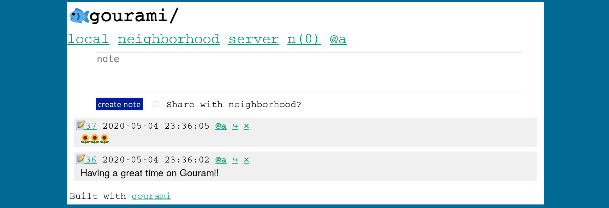

some change

# Gourami

An intentionally small, ultra-lightweight social media network (ActivityPub integration TBD)

## Philosophy and Design

Gourami differs from existing social networks in a number of ways:
* **Intentionally small** -- designed to support 50-100 active users. I'm sure it could support more, but things could quickly become a mess. Gourami was hugely and directly inspired by the fantastic essay on [runyourown.social](https://runyourown.social)
* **Invite-only and closed** -- a community curated by the server admin, rather than open to all.
* **Free and open source** -- I find the privatization of the internet extremely concerning, especially the way that the very space for building community and networking with our friends is controlled by for-profit corporations with potentially different values and goals than their users.
* **A social network with physical context** -- Gourami should be easy to deploy in a physical space (such as a coffee shop or a local wireless network) or among people in a specific physical community, such as a school. In *How to Do Nothing*, Jenny Odell discusses the lack of a context, specifically physical and temporal context, in social media, and, while praising Mastodon, also calls for social networks that are tied to physical space. While Gourami does not force you to tie a deployment to a place, it is designed in such a way that such a deployment would be relatively easy.
* **Extremely lightweight & fast** -- very little Javascript, plain text, small page sizes. Should run on extremely lightweight/cheap hardware and low-bandwidth networks. 
* **[Brutalist](https://brutalist-web.design/)** -- Stark and minimal, the design and interface should emphasize, rather than hide, the underlying building blocks of the web that comprise it. This will give Gourami a feel similar to 90s or 2000s web forums. 
* **Simple and feature-averse** -- A simpler Gourami is much easier for me to develop, support and maintain. I want Gourami to be reliable software that people can build communities on top of, and severely limiting the feature set makes that much easier.

Some goals of this project that are work in progress:
* Support for [ActivityPub](https://activitypub.rocks/) federation
* Additional accessibility features

Read [this document](https://git.sr.ht/~alexwennerberg/gourami-social/tree/master/PHILOSOPHY.md) for more

## Dependencies:

* sqlite3
* sqlite3-dev

## Installation

[Install Rustup](https://doc.rust-lang.org/cargo/getting-started/installation.html) or Cargo

Clone this repository.

Run `cargo install --path .`

Set environment variables (todo -- add more details)

Run the local server with `gourami_social run`

## Deployment

**Gourami is in alpha / development stage.** I have a small server running with some of my friends, but this is absolutely not ready for any sort of production environment, and a key feature, ActivityPub federation, is not finished yet.

I think it'd be interesting to set this up so that it can be deployed on a Platform as a Service or Function as a Service offering, but I haven't found any great way to run Sqlite in that context. I may put together an ansible playbook or something.

## References

Many projects inspired my work here, and I want to mention them

* Jenny Odell's discussion of adding context to social media in *How to Do Nothing*
* https://runyourown.social/
* https://joinmastodon.org/
* https://sourcehut.org/    
* https://100r.co/site/mission.html
* https://solar.lowtechmagazine.com/2020/01/how-sustainable-is-a-solar-powered-website.html
* https://www.nycmesh.net/
* [Honk](https://flak.tedunangst.com/post/ActivityPub-as-it-has-been-understood) and Ted Unangst's work with ActivityPub
* https://github.com/rustodon/rustodon
* https://github.com/LemmyNet/lemmy
