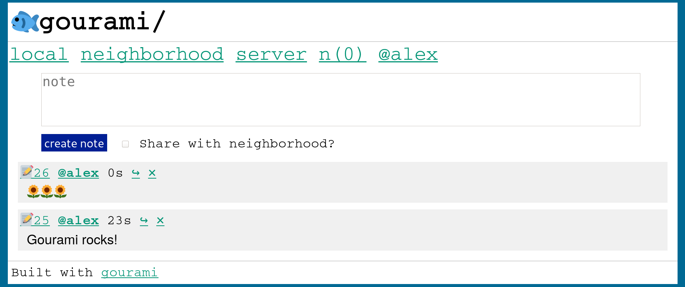

# 🐟gourami

An intentionally small, ultra-lightweight ActivityPub social network. See a live public demo at https://dev.gourami.social/ and [reach out to me](mailto:alex@alexwennerberg.com) if you want an invite so you can try it out.

## Philosophy and Design

Gourami differs from existing social networks in a number of ways:
* **Intentionally small** -- designed to support 50-100 active users. I'm sure it could support more, but things could quickly become a mess. Gourami was hugely and directly inspired by the fantastic essay on [runyourown.social](https://runyourown.social). Gourami is designed to support relatively small communities, maybe tied to a specific interest, community, or physical location.
* **Decentralized** -- Gourami uses [ActivityPub](https://activitypub.rocks/) to connect separate servers, but with an implementation that differs from existing ActivityPub servers such as Mastodon. Instances federate at the server level, rather than the user level, which means all users on the server share the same "neighborhood".
* **Invite-only and closed** -- a community curated by the server admin, rather than open to all. You can choose to make posts on your instance public, but they are private by default.
* **Free and open source** -- I find very concerning the way that the very space for building community and networking with our friends is controlled by corporations with potentially different values and goals than their users. Large, for-profit social networks have economic incentives that distorts the content and the kind of communities that can develop on them. Gourami is 100% free and open source, licensed under [AGPL v3](LICENSE).
* **A social network with physical context** -- Gourami should be easy to deploy in a physical space (such as a home, apartment building, coffee shop or [wireless mesh network](https://www.nycmesh.net/)) or among people in a specific physical community, such as a university or town. In *How to Do Nothing*, Jenny Odell discusses the lack of a context, specifically physical and temporal context, in social media, and calls for social networks that are tied to physical space. While Gourami does not force you to tie a deployment to a place, it is designed in such a way that such a deployment would be relatively easy.
* **Extremely lightweight & fast** -- very little Javascript, plain text, small page sizes. Should run on extremely lightweight/cheap hardware and low-bandwidth networks. 
* **Old-school and [Brutalist](https://brutalist-web.design/)** -- Stark and minimal, the design and interface should emphasize, rather than hide, the underlying building blocks of the web that comprise it. This will give Gourami a feel similar to 90s or 2000s web forums, or Twitter circa 2009. 
* **Simple and feature-averse** -- A simpler Gourami is much easier for me to develop, support and maintain. I want Gourami to be reliable software that people can build communities on top of, and severely limiting the feature set makes that much easier. Once I get Gourami to a certain core feature set, my work will be dedicated to maintenance and care, rather than feature additions. This will allow people to develop long-term, stable social networks, and also develop forks without worrying about losing upstream changes.

*Features that aren't implemented yet:*

* **Mastodon/other AP server interop** -- Gourami manages identities in a somewhat different way than Mastodon and other ActivityPub microblogging services. I have experimented with Mastodon interop and it works to some degree, but I don't want to officially support it until it's more stable. It's currently disabled.

## Local Installation

Make sure you have the following dependencies:

* sqlite3
* libsqlite3-dev
* openssl
* libssl-dev

[Install Rustup](https://doc.rust-lang.org/cargo/getting-started/installation.html) or Cargo.

Clone this repository with `git clone https://github.com/alexwennerberg/gourami` 

Run `cargo install --path .`

Configuration is done via [dotenv](https://github.com/dotenv-rs/dotenv). For development and testing, the `sample_env` file is good to get started -- copy it to `.env` in the same directory that you're running gourami.

Run the local server with `gourami_social run`

To create a user account:

* Run the sql command `insert into registration_keys values ("123")`
* Go to `http://localhost:3030/register?key=123`
* Create an account and log in

## Deployment

**Gourami is in alpha / development stage.**

I would love if you gave Gourami a shot, but be aware that issues may arise. If you would like to follow or join my server, please reach out to me! I'm also happy to help anyone set up their instance. More information on setting up a server is available in the [admin guide](docs/ADMIN_GUIDE.md).

## References

Many projects inspired my work here, and I want to mention them.

* Jenny Odell's discussion of adding context to social media in *How to Do Nothing*
* https://runyourown.social/
* https://joinmastodon.org/
* https://sourcehut.org/    
* https://100r.co/site/mission.html
* https://solar.lowtechmagazine.com/2020/01/how-sustainable-is-a-solar-powered-website.html
* https://internethealthreport.org/2018/the-internet-uses-more-electricity-than/
* https://www.nycmesh.net/
* [Honk](https://flak.tedunangst.com/post/ActivityPub-as-it-has-been-understood) and Ted Unangst's work with ActivityPub
* https://github.com/rustodon/rustodon
* https://github.com/LemmyNet/lemmy
* https://gemini.circumlunar.space/space

Logo from https://twemoji.twitter.com/
